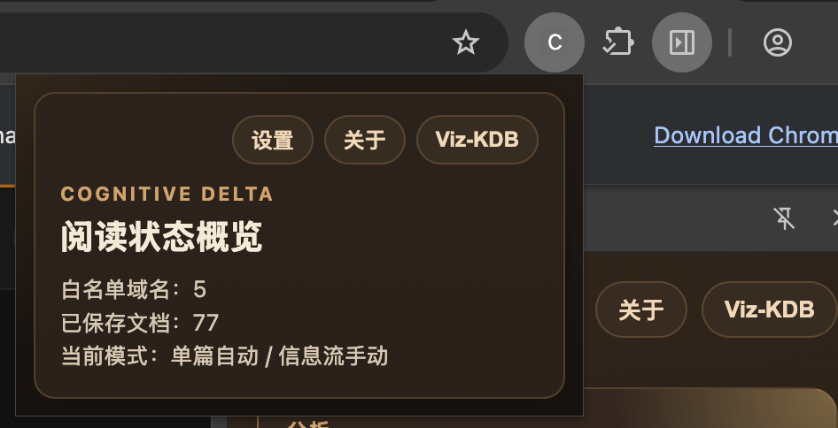
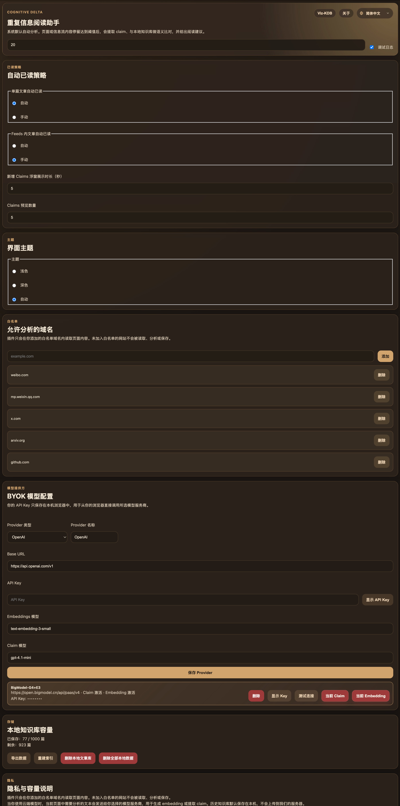
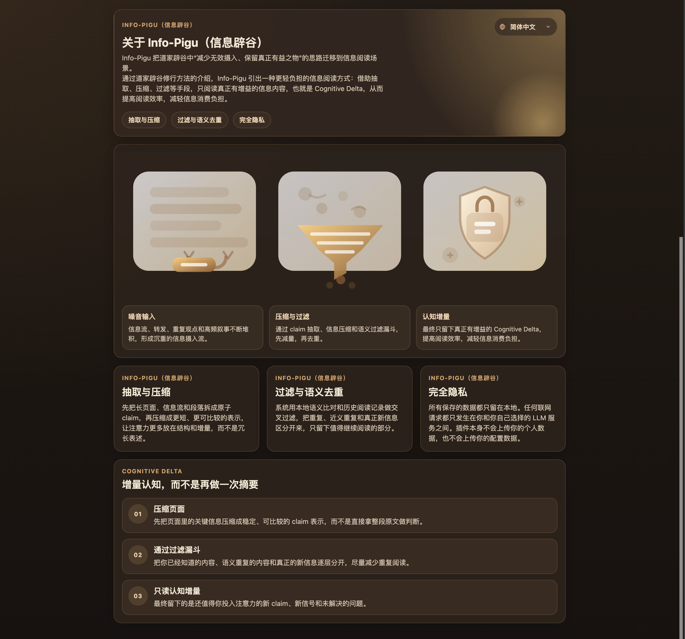
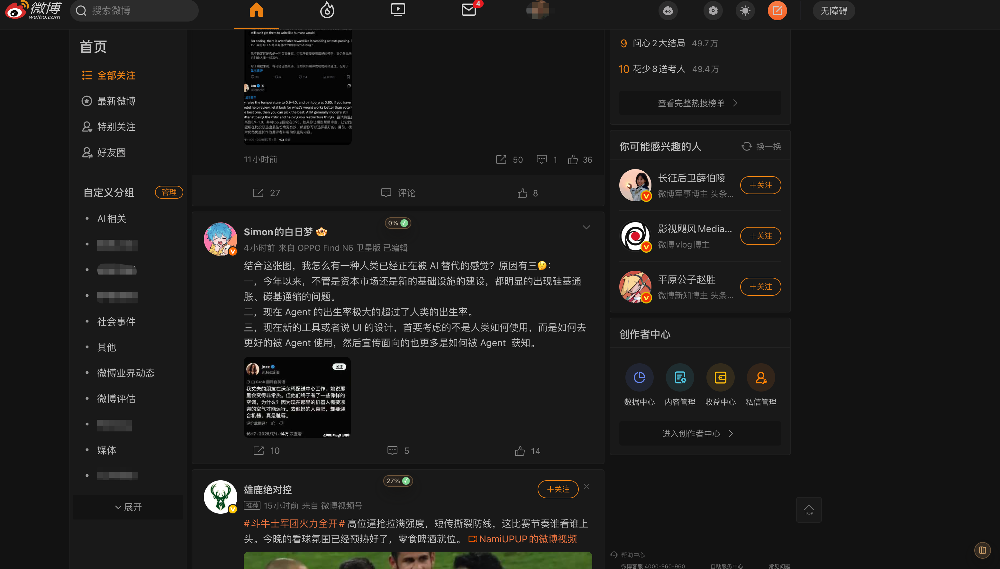
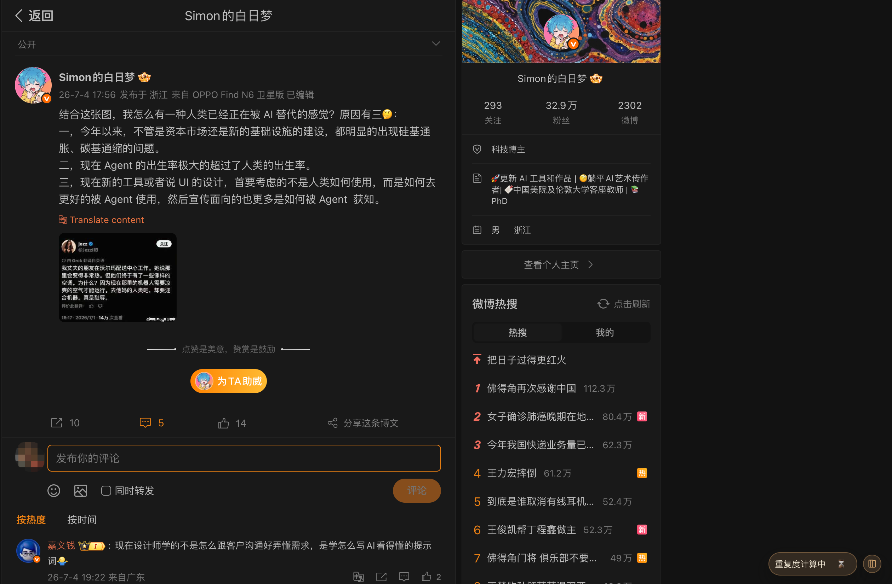
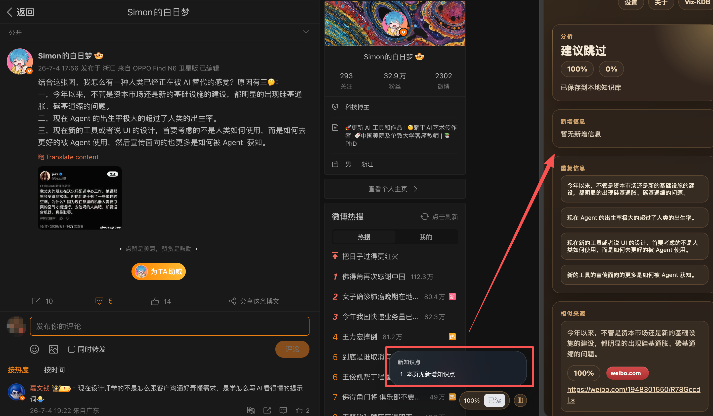
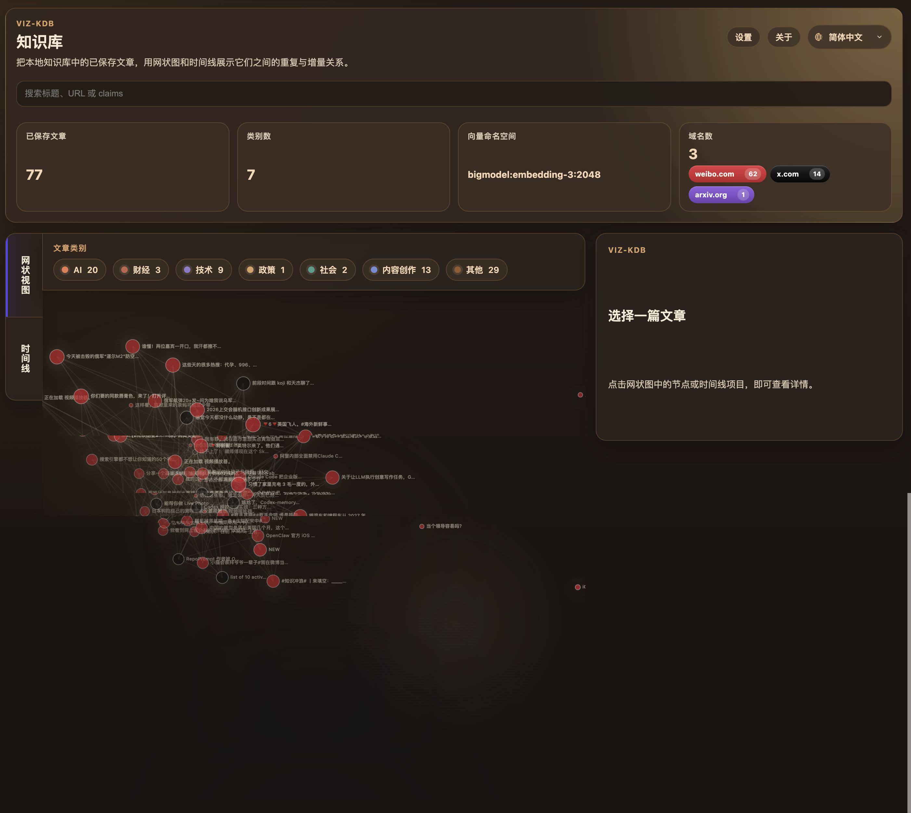
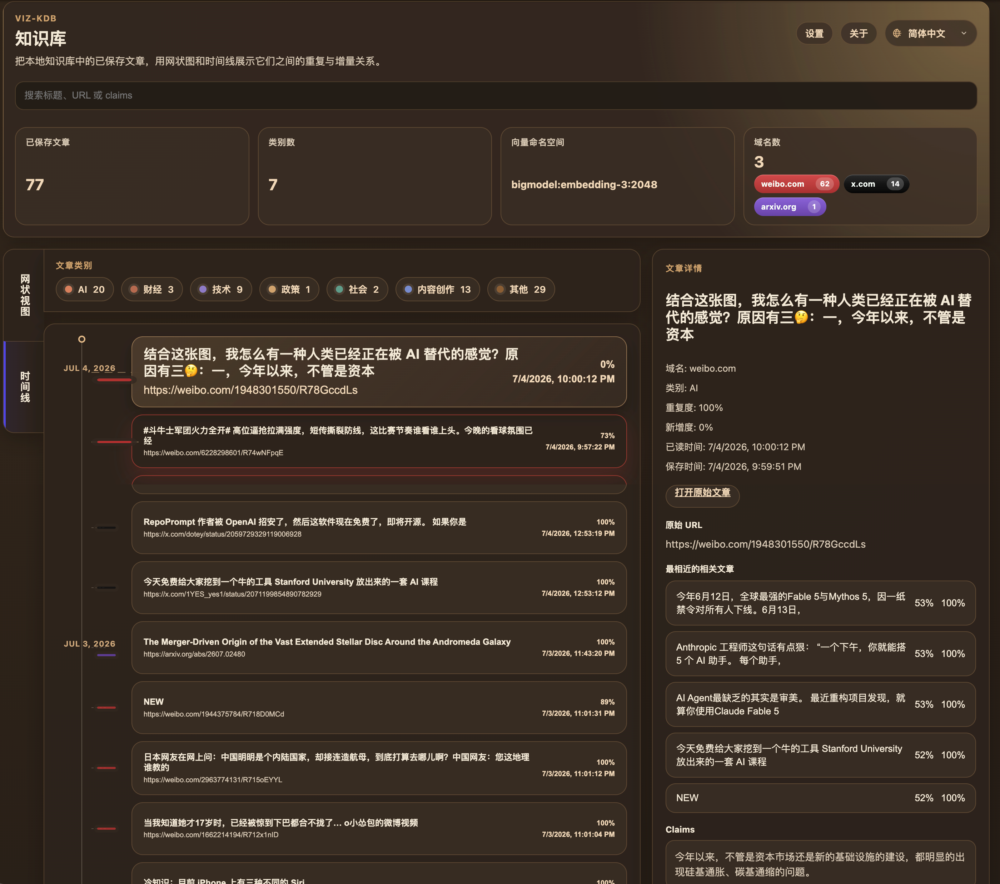

# Cognitive Delta

[中文](./README.md) | [English](./README_EN.md)

A Chrome extension for high-volume reading workflows. While you browse articles or feeds, Cognitive Delta extracts the main text, measures duplication, identifies novel claims, and stores the results in a local knowledge base. It then helps you decide whether a page is worth reading through its Side Panel and Viz-KDB visualizations.

## Overview

In an information-saturated environment, the scarce resource is not content. It is net new information.

Cognitive Delta is not designed as a bookmark manager or a generic summarizer. It focuses on information delta:

- Detect the actual article body on the current page
- Ignore video overlays, UI chrome, platform noise, and non-body text
- Extract claims from the body content
- Compare them against your local reading history
- Tell you what is repetitive, what is new, and whether the page is worth deeper reading

Typical use cases:

- Quickly deciding whether a Weibo or X feed item is worth opening
- Reviewing novel claims on a single-article detail page
- Capturing knowledge from WeChat articles, arXiv papers, and GitHub project homepages
- Revisiting your reading history by topic, source domain, and timeline in Viz-KDB

## Key Features

- Supports both feed mode and single-article mode
- Automatic or manual duplicate analysis
- Novel claim extraction focused on body content rather than metadata noise
- Side Panel with duplicate sources, similar content, and novel claims
- New Claims Popup for fast in-page feedback
- Local KDB (Knowledge Database) for persistent reading memory
- Viz-KDB graph view and timeline view
- Domain statistics aggregated by whitelisted platforms
- Multilingual UI: `Simplified Chinese / Traditional Chinese / English`
- Configurable providers:
  - OpenAI
  - DeepSeek
  - BigModel
  - Custom OpenAI-compatible endpoints

## Supported Platforms

- `weibo.com`
  - feed pages
  - single-post detail pages
- `x.com`
  - feed pages
  - single-post detail pages
- `mp.weixin.qq.com`
  - WeChat Official Account article pages
- `arxiv.org/abs/...`
  - uses the abstract for duplicate analysis and claim extraction
- `github.com/<owner>/<repo>`
  - uses the project description and README as the analysis source
- Generic article pages
  - basic support for pages with clear long-form article structure

## Installation

Two installation paths are supported:

- Method 1: download the source code, build locally, then load it into Chrome / Edge
- Method 2: download the prebuilt extension `.zip`, extract it, then load it into Chrome

### Method 1: Build from source and install locally

#### Step 1. Get the source code

```bash
git clone https://github.com/bluelava/infopigu.git
cd infopigu
```

#### Step 2. Install dependencies

```bash
pnpm install
```

#### Step 3. Build the extension

```bash
pnpm build
```

Build outputs:

- unpacked extension directory: `dist/`
- release artifact: `release/cognitive-delta-extension.zip`

#### Step 4. Install it in Chrome

1. Open `chrome://extensions/`
2. Enable `Developer mode`
3. Click `Load unpacked`
4. Select the `dist/` directory in this repository

#### Step 5. Install it in Edge

1. Open `edge://extensions/`
2. Enable `Developer mode`
3. Click `Load unpacked`
4. Select the `dist/` directory in this repository

### Method 2: Download the prebuilt ZIP and install it

Note: Chrome and Edge cannot install a `.zip` extension package directly. The correct flow is: download the zip, extract it, then load the extracted directory as an unpacked extension.

#### Step 1. Download the prebuilt ZIP

Download the compiled package:

- `release/cognitive-delta-extension.zip`

If you are downloading it from a GitHub Release or a shared artifact, the process is the same.

#### Step 2. Extract the ZIP

On macOS / Linux:

```bash
unzip cognitive-delta-extension.zip -d /tmp/cognitive-delta-extension
```

On Windows, you can simply extract it with File Explorer.

After extraction, the target directory should contain files such as:

- `manifest.json`
- `assets/`
- `index.html`
- `options.html`
- `sidepanel.html`

#### Step 3. Install the extracted extension in Chrome

1. Open `chrome://extensions/`
2. Enable `Developer mode`
3. Click `Load unpacked`
4. Select the extracted directory, for example `/tmp/cognitive-delta-extension`

#### Step 4. Install the extracted extension in Edge

1. Open `edge://extensions/`
2. Enable `Developer mode`
3. Click `Load unpacked`
4. Select the extracted directory

### First-time setup

Open the extension `Options` page and configure:

1. Whitelisted domains
2. Claim provider
3. Embedding provider
4. Default models
5. Auto-analysis, dwell threshold, language, and theme

Recommended whitelist to start with:

- `weibo.com`
- `x.com`
- `mp.weixin.qq.com`
- `arxiv.org`
- `github.com`

## How It Works

### Feed Mode

On Weibo or X feeds, the extension shows a compact duplicate-analysis badge near each feed item. Once the dwell conditions are met, it extracts only the current post body and analyzes duplication and novelty.

This lets you quickly tell:

- whether the item is something you have effectively already read
- whether it is just a repeated retelling
- whether it contains novel claims worth opening in detail

### Single-Article Mode

On single-article pages, the extension will:

- extract the article body
- compute duplication
- identify novel claims
- show the full result in the Side Panel
- re-display the claims popup when hovering over the KDB icon

### Viz-KDB

Viz-KDB provides a visualization layer on top of your local knowledge base:

- document count
- category distribution
- domain/platform distribution
- graph relationships
- timeline view

It is useful for reviewing what you have read recently and where your attention has been concentrated.

## Screenshots

### Overview / Settings / About







### Weibo Flow







### Viz-KDB





## Development Commands

```bash
pnpm dev
pnpm build
pnpm test
pnpm lint
```

## Repository Structure

```text
src/
  background/   background jobs, analysis queue, provider calls
  content/      page detection, extraction, floating UI, popup interactions
  sidepanel/    result detail panel
  options/      settings UI
  vizkdb/       knowledge-base visualization
  db/           IndexedDB / Dexie persistence
  ai/           LLM and embedding provider adapters
tests/          unit, integration, and E2E tests
release/        built release artifacts
```

## Privacy and Data Handling

- The extension only activates on whitelisted sites
- Read history, claims, and analysis results are primarily stored locally
- Cloud usage depends on the provider you configure
- Whether content is sent to an external model endpoint depends on your local settings and the current analysis flow

## Good Next Extensions

- More platform adapters organized under `platforms/<site>/`
- Better claim quality scoring and classification
- Richer Viz-KDB statistics and interactions
- More complete Chrome Web Store collateral and compliance documentation
